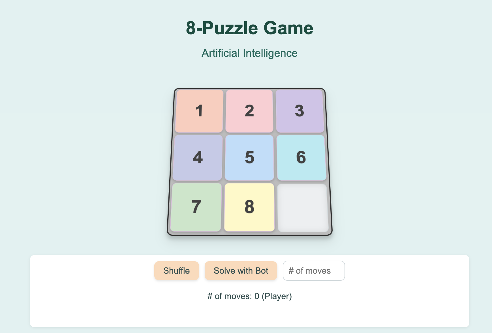

# 8-Puzzle Game

A modern implementation of the classic 8-puzzle sliding tile game built with TypeScript and featuring an AI solver using the A* algorithm.

## 🎯 About

The 8-puzzle is a classic sliding puzzle game consisting of a 3×3 grid with 8 numbered tiles and one empty space. The goal is to arrange the tiles in numerical order (1-8) by sliding them into the empty space.

This implementation features:
- **Modern TypeScript codebase** with strong typing
- **AI Solver** using A* search algorithm with Manhattan distance heuristic
- **Smooth animations** and 3D visual effects
- **Click-to-move** intuitive controls
- **Customizable shuffle** with variable move counts
- **Real-time move tracking** for both player and AI

## 🚀 Features

- **Interactive Gameplay**: Click on tiles adjacent to the empty space to move them
- **AI Solver**: Watch the AI solve any puzzle configuration automatically
- **Shuffle Function**: Randomize the puzzle with customizable number of moves
- **Move Counter**: Track your progress with real-time move counting
- **Win Detection**: Automatic detection and celebration when puzzle is solved
- **Responsive Design**: Clean, modern UI with 3D tile effects
- **Performance Optimized**: Efficient algorithms and smooth animations

## 📸 Screenshot



*The clean, modern interface features numbered tiles with 3D effects, intuitive controls, and an AI solver button.*

## 🛠️ Technologies Used

- **TypeScript** - Type-safe JavaScript with modern ES features
- **Vite** - Fast build tool and development server
- **HTML5/CSS3** - Modern web standards with CSS Grid and transforms
- **A* Algorithm** - Optimal pathfinding for AI solver
- **Vitest** - Fast unit testing framework

## 📦 Installation

### Prerequisites
- Node.js (v14 or higher)
- npm, pnpm or yarn

### Setup
1. Clone the repository:
   ```bash
   git clone <repository-url>
   cd 8-puzzle-js
   ```

2. Install dependencies:
   ```bash
   npm install
   ```

3. Start the development server:
   ```bash
   npm run dev
   ```

4. Open your browser and navigate to `http://localhost:5173`

## 🎮 How to Play

1. **Objective**: Arrange the numbered tiles (1-8) in order with the empty space in the bottom-right corner

2. **Controls**: Click on any tile adjacent to the empty space to slide it

3. **Shuffle**: Click the "Shuffle" button to randomize the puzzle
   - Enter a number in the input field to specify how many random moves to make
   - Default is 1000 moves for a good challenge

4. **AI Solver**: Click "Solve with Bot" to watch the AI solve the puzzle automatically
   - Uses A* algorithm with Manhattan distance heuristic
   - Shows the optimal solution path

5. **Win Condition**: When all tiles are in the correct order (1-8), you win!

## 🏗️ Project Structure

```
8-puzzle-js/
├── src/
│   ├── main.ts          # Application entry point
│   ├── gameUI.ts        # Main game controller and UI logic
│   ├── puzzleLogic.ts   # Core puzzle logic and validation
│   ├── astar.ts         # A* algorithm implementation
│   ├── domUtils.ts      # DOM manipulation utilities
│   └── types.ts         # TypeScript type definitions
├── css/
│   └── style.css        # Game styling and animations
├── index.html           # Main HTML template
├── dist/                # Built files (generated)
└── tests/               # Unit tests
```

## 🧠 AI Algorithm

The AI solver uses the **A* search algorithm** with the following features:

- **Heuristic**: Manhattan distance (sum of distances each tile is from its goal position)
- **Optimality**: Guarantees the shortest solution path
- **Performance**: Efficiently explores the search space using priority queue
- **Visualization**: Shows the solution step-by-step with smooth animations

### Algorithm Details
- **State Space**: Each puzzle configuration is a state
- **Actions**: Moving tiles up, down, left, or right into empty space
- **Goal Test**: All tiles in positions 1-8 with empty space at position 9
- **Path Cost**: Number of moves taken
- **Heuristic**: Manhattan distance ensures admissibility

## 📊 Performance

- **Search Efficiency**: A* algorithm typically solves puzzles in under 100ms
- **Animation Smoothness**: 60fps animations with CSS transforms
- **Memory Usage**: Optimized state representation and garbage collection
- **Bundle Size**: ~10KB gzipped for fast loading

## 🧪 Testing

Run the test suite:
```bash
npm test
```

Run tests with UI:
```bash
npm run test:ui
```

The project includes comprehensive tests for:
- Puzzle logic and validation
- A* algorithm correctness
- State transitions and move validation
- Edge cases and error handling

## 🚀 Building for Production

Create a production build:
```bash
npm run build
```

The built files will be in the `dist/` directory, ready for deployment to any static hosting service.

## 🎨 Customization

### Styling
- Modify `css/style.css` to change colors, animations, and layout
- Tile colors are defined with CSS custom properties for easy theming

### Game Logic
- Adjust animation duration in `gameUI.ts` (animationDuration property)
- Modify shuffle algorithm in `handleMixClick()` method
- Customize AI visualization speed in `animateSolution()` method

### AI Behavior
- Experiment with different heuristics in `astar.ts`
- Adjust search parameters and optimization strategies

## 🤝 Contributing

1. Fork the repository
2. Create a feature branch (`git checkout -b feature/amazing-feature`)
3. Commit your changes (`git commit -m 'Add some amazing feature'`)
4. Push to the branch (`git push origin feature/amazing-feature`)
5. Open a Pull Request

## 📝 License

This project is licensed under the MIT License - see the [LICENSE](LICENSE) file for details.

## 👨‍💻 Author

**Vagner Santana**

## 🎯 Future Enhancements

- [ ] Add difficulty levels (different grid sizes)
- [ ] Implement different AI algorithms (IDA*, BFS, etc.)
- [ ] Add sound effects and background music
- [ ] Include puzzle generation with guaranteed solvability
- [ ] Add multiplayer competitive mode
- [ ] Implement puzzle solver comparison metrics
- [ ] Add mobile touch gesture support

## 📚 Educational Value

This project demonstrates several important computer science concepts:

- **Search Algorithms**: A* implementation with heuristics
- **Data Structures**: Priority queues, arrays, and state representation
- **Algorithm Analysis**: Time and space complexity considerations
- **Software Architecture**: Modular design with separation of concerns
- **Testing**: Unit testing and test-driven development
- **Modern Web Development**: TypeScript, build tools, and optimization

Perfect for students learning artificial intelligence, algorithms, or modern web development techniques.
